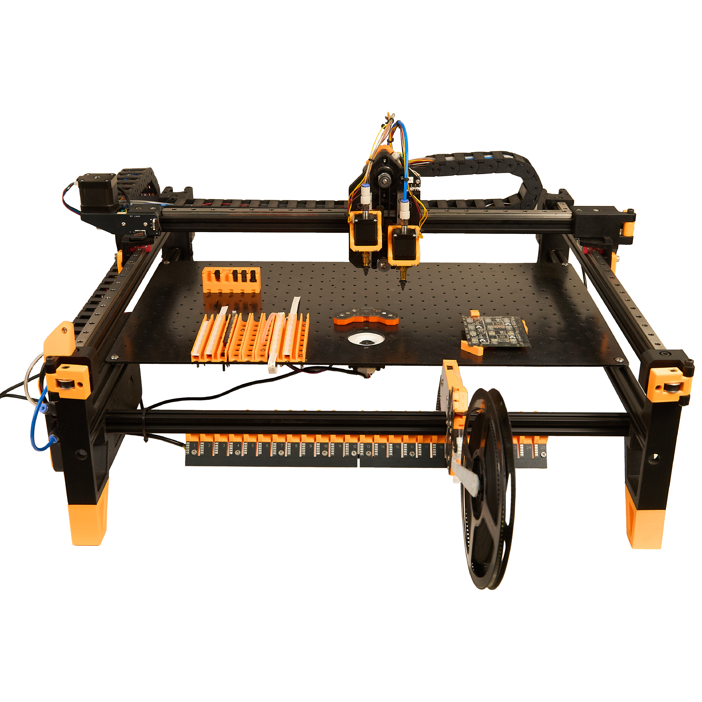

# Placestation

Placestation is a desktop **pick-and-place machine** that brings accurate, reliable, and fast PCB assembly to your workbench.  
Derived from the open-source [LumenPnP](https://github.com/opulo-inc/lumenpnp) design, Placestation adds hardware upgrades—such as a **Raspberry Pi 4 controller** and a **stainless-steel, powder-coated staging plate**—to deliver professional performance in a compact footprint.

---

## Highlights

* **Accurate** – Precision placement down to **0402** components with 0.4 mm lead pitch.
* **Reliable** – Dual HD cameras with custom optics for high-resolution calibration and repeatable results.
* **Fast** – Throughput up to **1,580 CPH** (950 CPH with full vision enabled).
* **Autonomous** – Powered feeders handle thousands of parts without interruption.
* **Versatile** – Configurable staging plates allow exceptionally large PCB panels or unique board geometries.

---

## Hardware Specs

| Feature                          | Specification                                  |
|-----------------------------------|-------------------------------------------------|
| Maximum PCB Size (Dual Plate)     | 120 × 390 mm or 240 × 150 mm (2×)               |
| Maximum PCB Size (Triple Plate)   | 120 × 390 mm or 330 × 150 mm (2×)               |
| Minimum Part Size                 | 0402                                           |
| Minimum Lead Pitch                | 0.4 mm                                         |
| Max Part Height / Weight          | 20 mm / 25 g                                    |
| Feeder Support                    | Powered feeders 8 mm & 12 mm; strip feeders 8–44 mm |
| Machine Dimensions                | 765 × 710 × 270 mm                              |
| Power Requirements                | 100–240 V AC, 50/60 Hz, max consumption 145 W   |
| Controller                        | **Raspberry Pi 4**                              |

The **stainless-steel, powder-coated staging plate** provides exceptional rigidity and corrosion resistance for consistent placements.

---

## Software

Placestation uses [OpenPnP](https://openpnp.org/) for motion control and vision.  
The onboard Raspberry Pi 4 runs Ubuntu 20.04 and handles:

* 2× 1080 p USB camera feeds  
* 1× USB serial interface  
